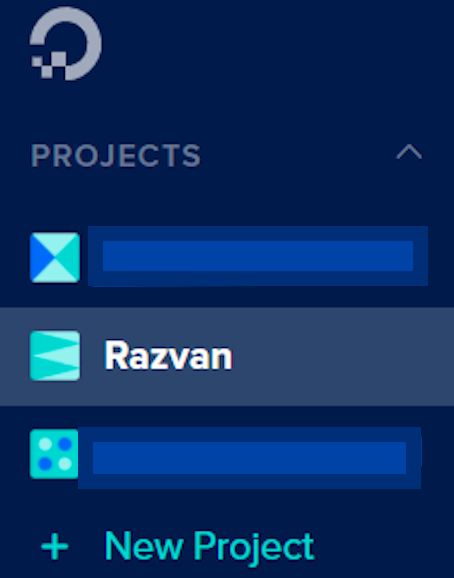
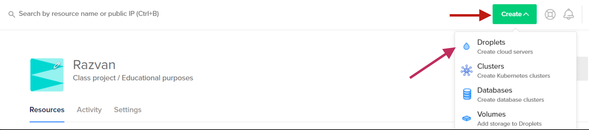
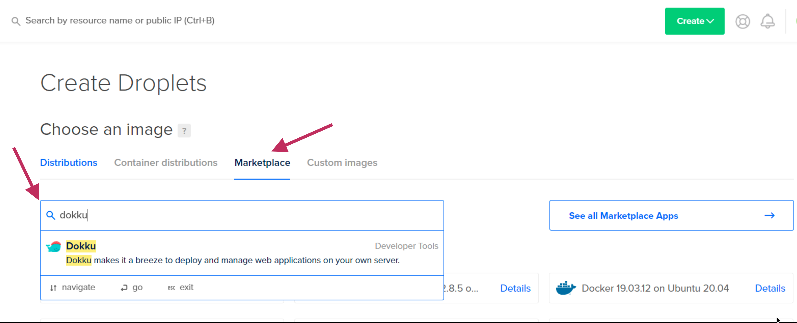
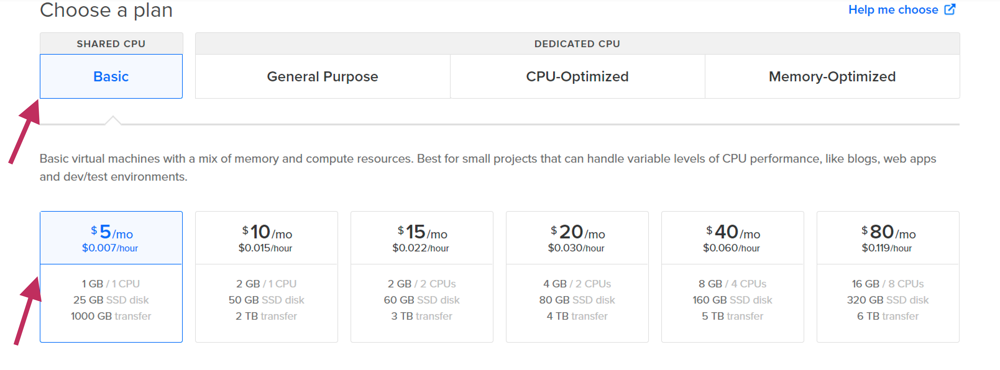
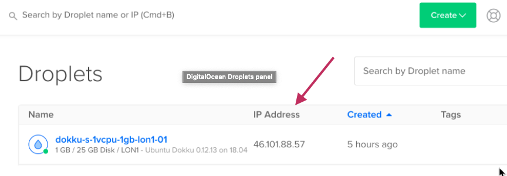
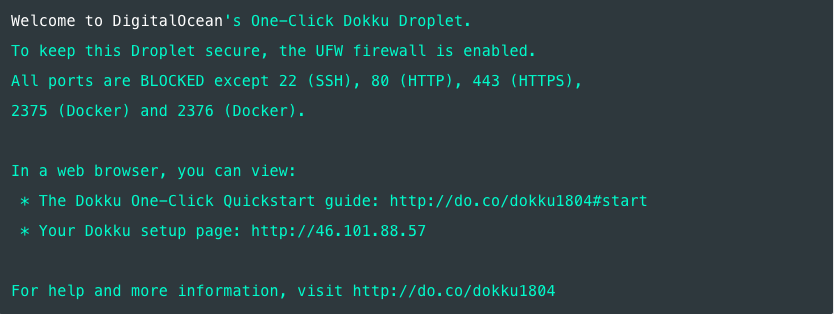
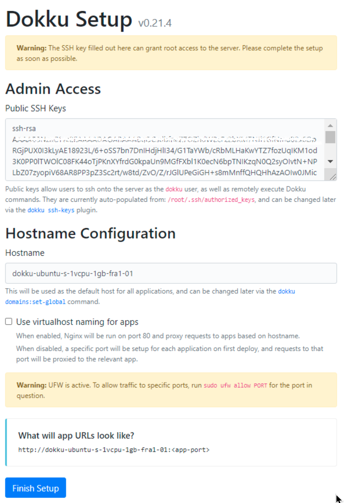
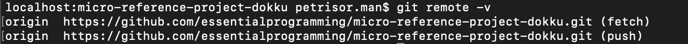

##  Steps for deploying Spring project to Dokku 
1. ##### Setting up DigitalOcean droplet  
   * Log in into Digital Ocean Account  
   * Choose the desired project where you want your droplet to reside from left hand side menu. In our example we chose to create our droplet in ***Razvan*** project. 
   
   * After the desired Project is selected, create a new droplet by clicking the ```Create``` green button and after that select Droplet item from the list.  
   Like in the example below :   
    
   * After clicking Droplet item from list choose Marketplace and search for ***dokku*** keyword in the *Search keyword* text box.  
     Like in the example below :  
     
   * After choosing the Dokku 0.21.4 on Ubuntu 20.04 *(newest version at the time of writing)* you will need to choose a plan.  
   Choose the plan like in the below example if you are planning to use this droplet only for testing purposes.
      
   * The next thing you'll be asked when you scroll down is what region you want your droplet to be in.  
   Select any region that makes sense for you. We chose ```Frankfurt``` datacenter as it is closer to our location.
   * Leave the *Select additional options* checkboxes unchecked.  
   * In the Authentication section, if you already created a ssh key select the one you own.  
   If you don't have one set up follow these guidelines :   
        * For Linux : https://www.digitalocean.com/community/tutorials/how-to-configure-ssh-key-based-authentication-on-a-linux-server
        * For Windows : https://www.digitalocean.com/docs/droplets/how-to/add-ssh-keys/create-with-putty/  
   * After the ssh-keys setup is done, you can rename your hostname to a more specific one, make sure that the droplet will be assigned to the desired project,
   and finally press the ```Create Droplet``` green button at the end of the page.  
   *It will take a few minutes for it to be available*
   
2. ##### Setting up the droplet
   * Once the Droplet has been created, it will have an IP address.  
    Copy the IP address into your clipboard, and open a terminal.  
    We're going to use SSH to connect to our Droplet.
      
    
   * Write inside the terminal the following line: 
       ```
       ssh root@46.101.88.57
        ```
       > **_NOTE:_**  Your IP address will be different than mine, so make sure you use the one that you copied from the DigitalOcean Droplets panel..
   * If the login is successful, you should see some output similar to this as part of Ubuntu's Message of the Day:  
       
       > **_NOTE:_**  You may find that your SSH connection will drop with the message "Please wait while we get your droplet ready...".  
       If that's the case, your Droplet may still be performing some initialization steps, even though the Droplets panel said it was ready. Just try again in a few minutes.
   * As instructed in the terminal, in order to complete the setup we need to access the Dokku setup page. Open a web browser and access your server using the ```http://<ip address>:```  
   
         
        
       Here you are asked to provide your SSH key. Since we have already provided it in a previous step when we initially set up the droplet, this should be pre-filled.  
       If you are using this for testing puropse only don't check the ***Use virtualhost naming for apps*** - this can be changed afterwards  
        * If you have a domain that you want to use with this box (e.g. example.com), then you can turn on virtualhost naming so that your apps are accessed as subdomains. For example, creating an app called "Demo" will mean that you will be to access your application at http://demo.example.com

        * If you do not have a domain that you wish to use for your Dokku server, then you should leave this box unchecked. This will mean that your apps would become available on a specific port number, e.g. http://46.101.88.57:3000. You will need to configure the firewall to open specific application ports.
    * Now you can click "Finish Setup" to proceed. Your Dokku server is now ready!
   
3. ##### Deploying 
    * Clone this repository via 
     ```git clone https://github.com/essentialprogramming/micro-reference-project-dokku.git``` command
    * By executing the following git command ```git remote -v ``` you should get the following output :  
        
    * The last thing we need to do is add a Git remote that points to our Dokku instance.  
    Since Dokku uses Git to deploy applications, every change you make that you want to deploy to the server must exist in Git at some stage.  
    You can do this with the following command in the terminal :  
    
        ```
           # With a domain name (replace example.com with your domain)
           git remote add dokku dokku@example.com:micro-reference-project-dokku
           
           # Without a domain name (replace the IP address with that of your server)
           git remote add dokku dokku@123.456.789.012:reference-project-dokku
         ```
    * Finally, use ***git push*** to push your application to the server. 
    This will kick off the build process using the Dockerfile attached to the project.  
    ```git push dokku master```  
    
    * You will start to see a lot of logging information spill out into the terminal, telling you how the build process is going.  
    After a couple of minutes, the build should finish and your site should be available.  
    To test this, try to access the application in your browser.  
        * If you are not using virtualhost naming and a domain, you should be able to reach it at ```http://<your IP address>:PORT``` and if you are using virtualhost naming and a domain you can reach it at ```http://express-demo.<your domain name>```.
        > **_NOTE:_** ***PORT*** is the one exposed in the Docker file, in our case is **8080**
 
    * Now all you need to do is to expose the web app to be accessible to the world. We can do that by opening a ssh connection with the server by executing the following command :  
        ```
        ssh root@46.101.88.57
        ```
      After you are inside the remote you need to setup firewall rules.  
      Since you using Ubuntu, this is super easy using ufw. Execute the following commands :  
      ```
      sudo ufw disable
      sudo ufw allow 8080/tcp
      sudo ufw enable
      ```
      
    * Now you can access your web app from outside world by accessing from the browser the following url ```http://<your IP address>:PORT```  
4. #### Useful commands  
    * Dokku specific commands :  
        * ```dokku apps:list``` - lists all the apps deployed with dokku on the environment
        * ```dokku enter [app_name]``` - enter running app container
        * ```apps:destroy [app_name]``` - permanently destroys an app
        * ```dokku proxy:[app_name] http:8070:8070``` - adds proxy port mappins to an app 
             > **_NOTE:_** This command will be used in case you want to update the port mappings 
             for a already deployed app (Server.class port value, and EXPOSE PORT value in Dockerfile needs to be updated aswell in order to successfully update the port of an already deployed app).  
             If you deploy it for the first time and in the Dockerfile the EXPOSE PORT command is specified  
             there is no need to execute this command.  
        * ```dokku apps:unlock [app_name]``` - unlocks an app for deployment (usually used when a deploy lock occurs)  
        * Other commands could be found by executing ```dokku help``` command
        
    * Dokku specific commands and other commands to execute in order to analyse and free disk space :  
        * ```dokku cleanup``` - cleans up exited/dead Docker containers and removes dangling images
        * ```docker system prune -a -f``` - removes all unused containers, networks, images (both dangling and unreferenced)
        * ```docker container prune``` - removes all stopped containers.
        * If you want to check disk space you can always execute ```df -h``` command but you can also install **ncdu** which is a disk usage viewer.  
        Do this by executing the following commands :  
        ```sudo apt-get update -y```  
        ```sudo apt-get install -y ncdu```  
        Start the ncdu by executing : ```sudo ncdu```

                                         


   