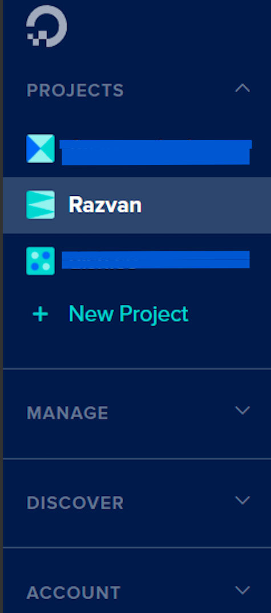

##  Steps for deploying Spring project to Dokku 
1. ##### Setting up DigitalOcean droplet  
   * Log in into Digital Ocean account  
   * Choose the desired project where you want your droplet to reside from left hand side menu. In our example we chose to create our droplet in ***Razvan*** project. 
   
   * After the desired Project is selected, create a new droplet by clicking the ```Create``` green button and after that select Droplet item from the list.  
   Like in the example below :   
    
   * After clicking Droplet item from list choose Marketplace and search for ***dokku*** keyword in the *Search keyword* text box.  
     Like in the example below :  
     
   * After choosing the Dokku 0.21.4 on Ubuntu 20.04 *(newest version at the time of writing)* you will need to choose a plan.  
   Choose the plan like in the below example if you are planning to use this droplet only for testing purposes.
      
   * The next thing you'll be asked when you scroll down is what region you want your droplet to be in.  
   Select any region that makes sense for you. We chose ```Frankfurt``` datacenter as it is closer to our location.
   * Leave the *Select additional options* checkboxes unchecked.  
   * In the Authentication section, if you already created a ssh key select the one you own.  
   If you don't have one set up follow these guidelines :   
        * For Linux : https://www.digitalocean.com/community/tutorials/how-to-configure-ssh-key-based-authentication-on-a-linux-server
        * For Windows : https://www.digitalocean.com/docs/droplets/how-to/add-ssh-keys/create-with-putty/  
   * After the ssh-keys setup is done, you can rename your hostname to a more specific one, make sure that the droplet will be assigned to the desired project,
   and finally press the ```Create Droplet``` green button at the end of the page.  
   *It will take a few minutes for it to be available*
   
2. ##### Setting up the droplet
   * Once the Droplet has been created, it will have an IP address.  
    Copy the IP address into your clipboard, and open a terminal.  
    We're going to use SSH to connect to our Droplet.
      
    
   * Write inside the terminal the following line: 
       ```
       ssh root@46.101.88.57
        ```
       > **_NOTE:_**  Your IP address will be different than mine, so make sure you use the one that you copied from the DigitalOcean Droplets panel..
   * If the login is successful, you should see some output similar to this as part of Ubuntu's Message of the Day:  
       
       > **_NOTE:_**  You may find that your SSH connection will drop with the message "Please wait while we get your droplet ready...".  
       If that's the case, your Droplet may still be performing some initialization steps, even though the Droplets panel said it was ready. Just try again in a few minutes.
   * As instructed in the terminal, in order to complete the setup we need to access the Dokku setup page. Open a web browser and access your server using the ```http://<ip address>:```  
   
         
        
       Here you are asked to provide your SSH key. Since we have already provided it in a previous step when we initially set up the droplet, this should be pre-filled.  
       If you are using this for testing puropse only don't check the ***Use virtualhost naming for apps*** - this can be changed afterwards  
        * If you have a domain that you want to use with this box (e.g. example.com), then you can turn on virtualhost naming so that your apps are accessed as subdomains. For example, creating an app called "Demo" will mean that you will be to access your application at http://demo.example.com

        * If you do not have a domain that you wish to use for your Dokku server, then you should leave this box unchecked. This will mean that your apps would become available on a specific port number, e.g. http://46.101.88.57:3000. You will need to configure the firewall to open specific application ports.
    * Now you can click "Finish Setup" to proceed. Your Dokku server is now ready!
   
3. ##### Deploying 
    * Clone this repository via 
     ```git clone https://github.com/essentialprogramming/micro-reference-project-dokku.git``` command


 
    
    
    
    
   
 


   